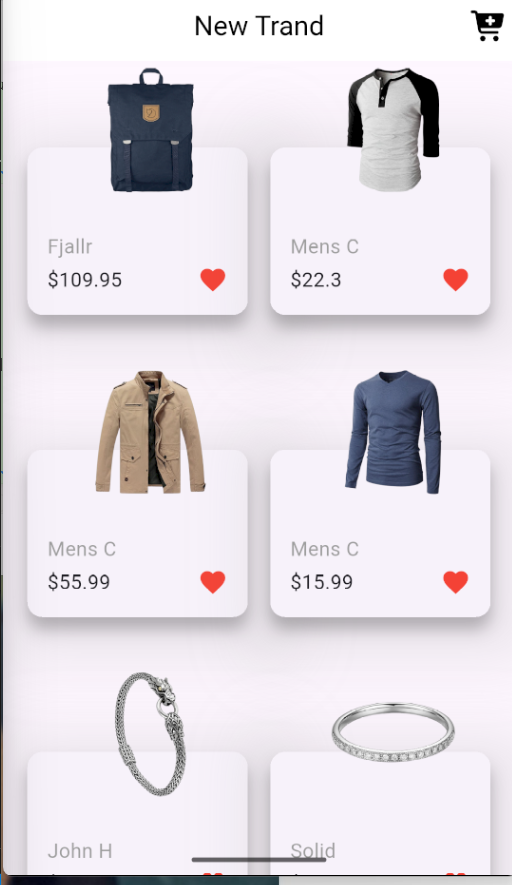
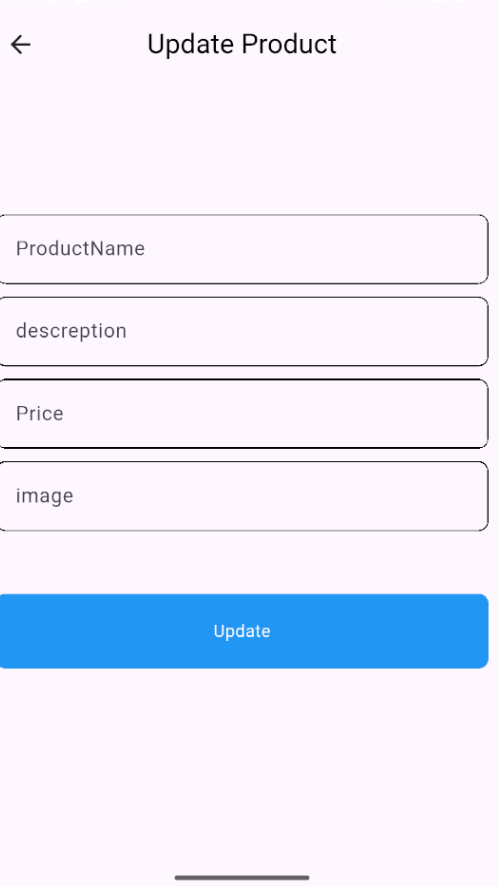

# 🛍️ Store App

A Flutter application that displays products from an online store using REST API and allows users to update product information with a clean and responsive user interface.

---

# 📸 App Screens

### 🏠 Home Screen

<p align="center">

</p>

Displays all available products retrieved from the API in a clean and responsive grid layout.

---

### ✏️ Update Product

<p align="center">

</p>

Allows users to update product information such as title, description, image URL, category, and price.

---

---

# ✨ Features

- 🛒 Display all products.
- 🔄 Update product details.
- 🌐 Fetch data from REST API.
- ⚡ Fast network requests using HTTP.
- 📱 Responsive UI.
- ♻️ Reusable Custom Widgets.

---

# 🛠️ Tech Stack

- Flutter
- Dart
- REST API
- HTTP
- JSON

---

# 📦 Packages

```yaml
dependencies:
  flutter:
    sdk: flutter
  http:
```

---

# 🏗️ Architecture

The project follows the **MVVM** architecture to keep the code organized and maintainable.

```text
lib
│
├── core
│   ├── helpers
│   │   └── api.dart
│   │
│   ├── models
│   │
│   ├── services
│   │
│   └── widgets
│
├── features
│   ├── home
│   ├── update_product
│   └── product_details
│
└── main.dart
```

---

# 📂 Folder Description

| Folder       | Description                           |
| ------------ | ------------------------------------- |
| **helpers**  | Handles API requests.                 |
| **models**   | Product data models.                  |
| **services** | Business logic and API communication. |
| **widgets**  | Reusable widgets.                     |
| **features** | Contains application screens.         |

# 🚀 Getting Started

Clone the repository

```bash
git clone https://github.com/mohamedayman891/store_app.git
```

Go to the project

```bash
cd store_app
```

Install dependencies

```bash
flutter pub get
```

Run the application

```bash
flutter run
```

---

# 👨‍💻 Developer

## Mohamed Ayman

**Flutter Developer**

Passionate about building modern, responsive, and scalable Flutter applications.

<p align="center">
<a href="https://github.com/mohamedayman891">

</a>

<a href="https://www.linkedin.com/in/mohamed-ayman09">

</a>
</p>

</div>

---

# 📬 Contact

If you have any questions, suggestions, or feedback, feel free to reach out.

- GitHub: https://github.com/mohamedayman891
- LinkedIn: https://www.linkedin.com/in/mohamed-ayman09

---

<div align="center">

## ⭐ Support

If you enjoyed this project, consider giving it a ⭐ on GitHub.

It really helps and motivates me to build more open-source Flutter projects.

---

### Made with ❤️ using Flutter

</div>
